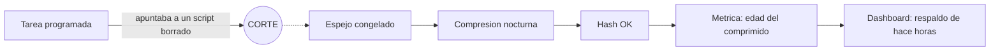

# Backups That Don't Lie

> Un backup se mide por la edad de su contenido, no por la de su archivo.

Este repositorio documenta, de forma sanitizada, la estrategia de backup y
recuperacion de un homelab personal, junto con tres casos reales: presion de
storage y postura de recuperacion, eventos de backup tratados como evidencia
de seguridad, y una migracion de estacion de trabajo que revelo que la
cadena de respaldos llevaba meses rota sin que nadie lo supiera.

Es parte de un portfolio tecnico pensado para entrevistas de trabajo. No es
documentacion operativa de un entorno en produccion: es una version
transformada -decisiones, patrones y aprendizajes- de un homelab real, sin
datos que permitan identificarlo o reproducirlo.

Lo que busca demostrar: el principio de que un backup se mide por la edad de
su contenido y no por la de su archivo, la practica de probar la
restauracion en vez de confiar en que el backup "corrio", y la honestidad
para documentar una falla de meses -y como se corrigio- en vez de
esconderla.

## En 30 segundos

| Indicador | Resultado |
|---|---|
| Tiempo que un respaldo estuvo congelado mientras la metrica decia "horas" | **casi 4 meses** |
| Eslabones de esa cadena que siguieron corriendo despues del corte | **4 de 5** |
| Recuperacion medida del servicio chico | **segundos** |
| Recuperacion medida del dominio documental | **menos de 2 minutos** |
| Cuarentena antes de borrar cualquier cosa en la migracion | **30 dias**, con manifiesto |

La metrica nueva mide **la edad del archivo mas reciente dentro del
respaldo**: ya no puede informar exito sobre contenido viejo.

## Indice

- [Ficha rapida para quien evalua](contexto.md)
- [Backup y recuperacion](docs/01-backup-y-recuperacion.md)
- [Caso de estudio: presion de storage y postura de recuperacion](docs/casos-de-estudio/01-presion-storage-y-recuperacion.md)
- [Caso de estudio: eventos de backup como evidencia SIEM](docs/casos-de-estudio/02-eventos-backup-como-evidencia-siem.md)
- [Caso de estudio: migracion de workstation y respaldos que mentian](docs/casos-de-estudio/03-migracion-de-workstation-y-respaldos-que-mentian.md)

## Parte de una serie

Este repo es una pieza de un proyecto mas grande: un **homelab personal**
operado como infraestructura real y documentado en cinco repos
independientes. Cada uno se lee solo; juntos muestran el entorno completo.

- [Zero Trust Remote Access](https://github.com/Nicolasperaltait/zero-trust-remote-access)
- [Backups That Don't Lie](https://github.com/Nicolasperaltait/backups-that-dont-lie) (este repo)
- [Alerts That Matter](https://github.com/Nicolasperaltait/alerts-that-matter)
- [Network Segmentation Playbook](https://github.com/Nicolasperaltait/network-segmentation-playbook)
- [Hypervisor as Control Plane](https://github.com/Nicolasperaltait/hypervisor-as-control-plane)

## Licencia

Ver [LICENSE.md](LICENSE.md).
