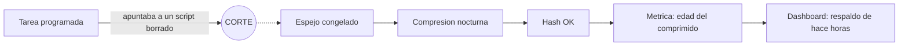
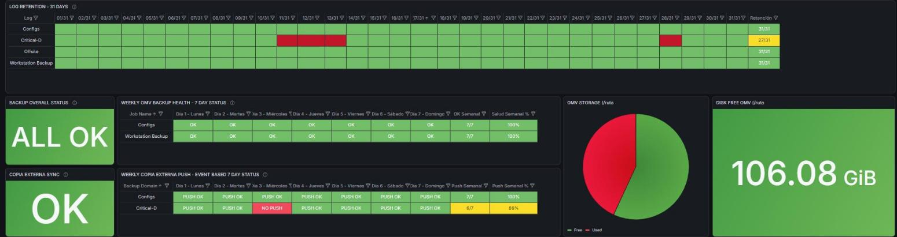
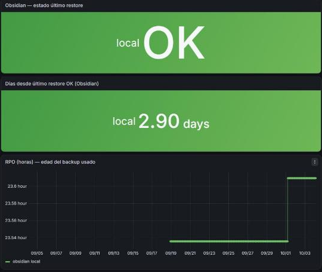
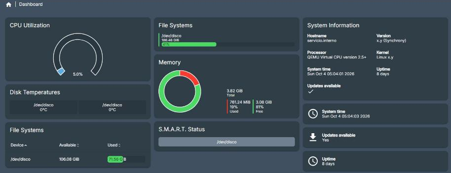

# Backups That Don't Lie

> Un backup se mide por la edad de su contenido, no por la de su archivo.

  
  
  
  
  

Este repositorio documenta, de forma sanitizada, la estrategia de backup y
recuperacion de una infraestructura productiva personal (homelab), junto con tres casos reales: presion de
storage y postura de recuperacion, eventos de backup tratados como evidencia
de seguridad, y una migracion de estacion de trabajo que revelo que la
cadena de respaldos llevaba meses rota sin que nadie lo supiera.

Es parte de un portfolio tecnico. **No es un laboratorio de prueba: es
infraestructura productiva.** No tiene la escala de una empresa, pero tiene
todas sus piezas -virtualizacion, red segmentada, DNS, almacenamiento, backups
con copia externa, monitoreo, SIEM, acceso remoto y aplicaciones en uso- y
funciona 24/7 sobre un hipervisor de tipo 1 (Proxmox VE) en un servidor dedicado. Cuando
algo falla, el impacto es real.

La documentacion operativa es privada. Esto es su version transformada
-decisiones, patrones y aprendizajes-, sin datos que permitan identificar o
reproducir el entorno.

Lo que busca demostrar: el principio de que un backup se mide por la edad de
su contenido y no por la de su archivo, la practica de probar la
restauracion en vez de confiar en que el backup "corrio", y la honestidad
para documentar una falla de meses -y como se corrigio- en vez de
esconderla.

## Escala chica, exigencia de produccion

| Pieza | Con que | Si falla |
|---|---|---|
| Virtualizacion | Proxmox VE, hipervisor de tipo 1; una maquina por funcion | cae todo lo demas |
| DNS interno | Pi-hole, resolucion para todos los equipos y servicios | todo parece caido aunque este sano |
| Red y acceso remoto | zonas por funcion; Tailscale sin puertos abiertos, politica por puerto | se pierde el aislamiento o el acceso desde afuera |
| Almacenamiento y backups | OpenMediaVault, backups nocturnos, copia cifrada externa, pruebas de restauracion | se pierde la capacidad de recuperar |
| Monitoreo y seguridad | Prometheus, Grafana, Wazuh y alertas al telefono | los incidentes pasan sin que nadie se entere |
| Aplicaciones propias | Docker detras de Nginx Proxy Manager; una envia correo real | se frena trabajo real |
| Codigo | Forgejo privado con integracion continua | no hay donde versionar ni desde donde desplegar |

Lo mismo que en una empresa, en chico: cambios con plan y rollback, evidencia,
alertas que avisan solas y controles que se prueban haciendolos fallar.

## En 30 segundos

| Indicador | Resultado |
|---|---|
| Tiempo que un respaldo estuvo congelado mientras la metrica decia "horas" | **casi 4 meses** |
| Eslabones de esa cadena que siguieron corriendo despues del corte | **4 de 5** |
| Recuperacion medida del servicio chico | **segundos** |
| Recuperacion medida del dominio documental | **menos de 2 minutos** |
| Cuarentena antes de borrar cualquier cosa en la migracion | **30 dias**, con manifiesto |

La metrica nueva mide **la edad del archivo mas reciente dentro del
respaldo**: ya no puede informar exito sobre contenido viejo.

## En vivo

_Capturas reales del entorno, con nombres, direcciones, usuarios y versiones reemplazados por su funcion._

31 dias de retencion por dominio, salud semanal y copia externa. Los rojos son fallas detectadas y avisadas, no escondidas.

Pruebas de restauracion: ultimo restore OK, dias desde el ultimo y RPO medido en cada corrida.

OpenMediaVault: el NAS que recibe los backups, 8 dias de uptime y discos con S.M.A.R.T. vigilado.

El codigo tambien es un dominio de backup: remoto propio y privado.

## Problema, decision, resultado

| Problema | Por que importaba | Que se hizo | Resultado |
|---|---|---|---|
| Un respaldo llevaba casi 4 meses congelado y la metrica decia "horas" | se habria restaurado algo viejo creyendo que era de ayer | medir la edad del contenido, no la del archivo | ya no puede informar exito sobre datos viejos |
| La copia fuera del sitio fallo varios dias sin avisar | la proteccion externa era una ilusion | aviso enganchado a la salida del proceso, que ocurre siempre | toda falla avisa |
| Formatear la estacion de trabajo daba miedo: nadie sabia que se perdia | historial de meses en un solo disco | migracion en fases, cuarentena de 30 dias y prueba en maquina limpia | rearmado probado leyendo solo el documento |
| La mayoria de los repositorios no tenia remoto | un disco que falla se lleva meses de historial | remoto privado con CI y proteccion en capas, con copia en frio | ninguna capa cae junto con otra |

El detalle de cada uno, con lo que salio mal en el camino, esta en los casos de estudio.

## Indice

- [Ficha rapida para quien evalua](contexto.md)
- [Backup y recuperacion](docs/01-backup-y-recuperacion.md)
- [Caso de estudio: presion de storage y postura de recuperacion](docs/casos-de-estudio/01-presion-storage-y-recuperacion.md)
- [Caso de estudio: eventos de backup como evidencia SIEM](docs/casos-de-estudio/02-eventos-backup-como-evidencia-siem.md)
- [Caso de estudio: migracion de workstation y respaldos que mentian](docs/casos-de-estudio/03-migracion-de-workstation-y-respaldos-que-mentian.md)
- [Caso de estudio: codigo que sobrevive](docs/casos-de-estudio/04-codigo-que-sobrevive.md)

## Parte de una serie

Este repo es una pieza de **[Homelab Prod](https://github.com/Nicolasperaltait/homelab)**:
la vista completa de una infraestructura productiva, chica en escala y completa
en piezas, encendida 24/7. Cada repo de la serie se lee solo; la portada los une.

- [Zero Trust Remote Access](https://github.com/Nicolasperaltait/zero-trust-remote-access)
- [Network Segmentation Playbook](https://github.com/Nicolasperaltait/network-segmentation-playbook)
- [Alerts That Matter](https://github.com/Nicolasperaltait/alerts-that-matter)
- [Backups That Don't Lie](https://github.com/Nicolasperaltait/backups-that-dont-lie) (este repo)
- [Hypervisor as Control Plane](https://github.com/Nicolasperaltait/hypervisor-as-control-plane)
- [SecOps Governance Blueprint](https://github.com/Nicolasperaltait/secops-governance-blueprint)

## Licencia

Ver [LICENSE.md](LICENSE.md).
